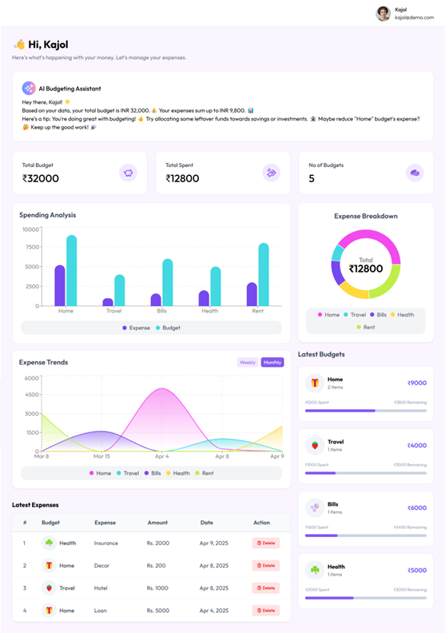
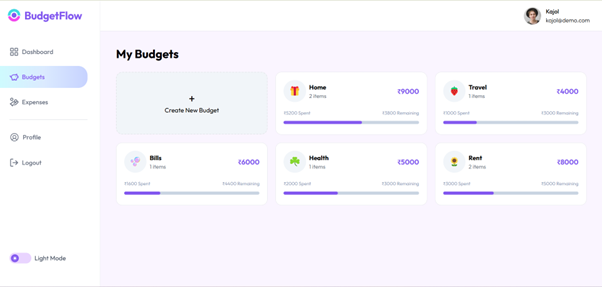
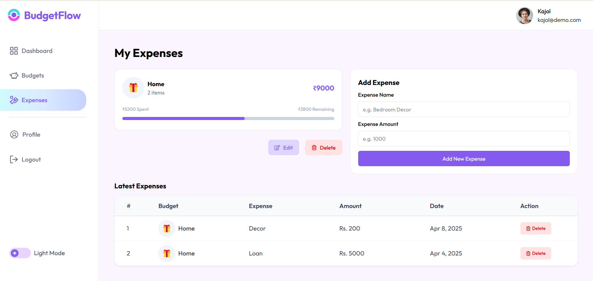
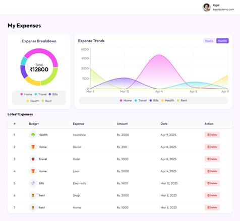

# BudgetFlow - Expense Tracker with AI Insights 💸🤖

BudgetFlow is a MERN stack application designed to help users manage their finances. With features such as budget tracking, expense management, AI-powered financial advice, and advanced data visualization, users can track spending, set budgets, and receive personalized insights to help manage their money effectively. 💰📊

## Table of Contents 📑
- [Features](#features)
- [Tech Stack](#tech-stack)
- [Getting Started](#getting-started)
- [Screenshots](#screenshots)
- [License](#license)

## Features ✨

- **User Authentication** 🔒: Secure login and registration with JWT authentication.
- **Create and Manage Budgets** 💵: Users can create, edit, and delete budgets.
- **Track Expenses** 🧾: Add, update, and delete expenses related to specific budgets.
- **Expense Breakdown** 🍕: Visualize the breakdown of expenses by category, with donut charts and bar graphs.
- **AI Financial Advice** 🤖💡: Get AI-powered summaries and insights about spending habits using the Gemini API.
- **Dashboard** 📊: A user-friendly dashboard to display all key metrics, including expense trends, budgets, and detailed financial insights.
- **Charts & Reports** 📉: Interactive charts that include:
  - Monthly/Weekly expense trends.
  - Budgets vs. actual spending bar chart.
  - Expense category breakdown donut charts.

## Tech Stack 🛠️

- **Frontend**: React.js, Axios, React Router
- **Backend**: Node.js, Express.js
- **Database**: MongoDB (with Mongoose)
- **Authentication**: JSON Web Tokens (JWT)
- **AI Insights**: Gemini API (for AI-generated summaries and advice)
- **Data Visualization**: Recharts

## Getting Started 🚀

### Prerequisites 📋

To get started, you’ll need to have the following installed on your machine:

- Node.js (>=14.x)
- MongoDB (locally or use a cloud database like MongoDB Atlas)
- Git (for version control)
- Gemini API key (for AI-powered insights)

### Clone the Repository 📂

```bash
git clone https://github.com/your-username/budgetflow-expense-tracker.git
cd budgetflow
```

### Install Dependencies 🔧

Install the backend and frontend dependencies:

1. **Backend**:
    ```bash
    cd backend
    npm install
    ```

2. **Frontend**:
    ```bash
    cd frontend
    npm install
    ```

### Environment Variables 🌍

Create a `.env` file in the `backend` directory and add the following variables:

```env
MONGODB_URI = your_mongodb_connection_string
JWT_SECRET = your_jwt_secret_key
PORT = port_no
GEMINI_API_KEY = your_gemini_api_key
CLOUDINARY_NAME = your_cloundinary_name
CLOUDINARY_API_KEY = your_cloundinary_api_key
CLOUDINARY_SECRET_KEY = your_cloundinary_secret_key
```

### Run the Application 🏃‍♀

1. **Start the backend**:

```bash
cd backend
npm run start
```

2. **Start the frontend**:

```bash
cd frontend
npm run dev
```

## Screenshots 📸

Here are some screenshots showcasing the app in action:

1. **Home Page**:  
   

1. **Dashboard**:  
   

2. **Add Budgets**:  
   

3. **Add Expenses**:  
   

4. **Expense Breakdown**:  
   


